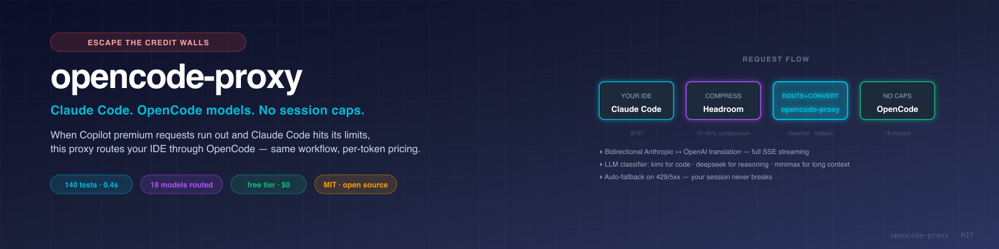

# opencode-proxy



**Use Claude Code with [OpenCode](https://opencode.ai) models — cheaper, smarter routing, and automatic context compression.**

This stack combines two tools:
- **opencode-proxy** — routes Claude Code requests to OpenCode, handles protocol translation and model selection
- **[Headroom](https://headroom-docs.vercel.app)** — *"The Context Optimization Layer for LLM Applications"* — compresses your conversation history before each request, cutting token usage by 15–50%

---

## Why does this exist?

[Claude Code](https://claude.ai/code) is a powerful AI coding assistant, but using it with Anthropic directly gets expensive fast. [OpenCode](https://opencode.ai) offers the same models (and others) at much lower cost — but plugging Claude Code into OpenCode directly has several problems:

### Problem 1 — Claude Code only speaks Anthropic, OpenCode models speak two protocols

Claude Code sends requests in **Anthropic format** (`/v1/messages`). But many OpenCode models expect **OpenAI format** (`/chat/completions`). Without this proxy, those models simply don't work.

This proxy automatically translates the request format — including full streaming support for tool calls.

### Problem 2 — Free and paid models live at different URLs

OpenCode has two tiers:
- **Paid (go-tier):** `https://opencode.ai/zen/go/v1`
- **Free:** `https://opencode.ai/zen/v1`

Claude Code only knows one `ANTHROPIC_BASE_URL`. If you point it at the go-tier URL and try to use a free model, the request goes to the wrong endpoint and fails. You can't point Claude Code at both URLs simultaneously.

This proxy knows which models are free vs paid and routes each request to the correct URL automatically.

### Problem 3 — Free model names don't work in Claude Code settings

If you try setting `"model": "north-mini-code-free"` or `"model": "mimo-v2.5-free"` in your Claude Code `settings.json`, it won't work — Claude Code validates model names against Anthropic's list, or passes them through without the right routing context.

This proxy lets you use simple routing tokens instead:
- `"model": "free-auto"` → automatically picks the best free model for your task
- `"model": "go-auto"` → automatically picks the best paid model for your task
- `"model": "claude-haiku-4-5"` → auto-mapped to `free-auto` (haiku = cheap = free tier)
- Any other `claude-*` model → auto-mapped to `go-auto`

### Problem 4 — Context grows, costs balloon

Long coding sessions accumulate a huge context window. Every request re-sends the entire conversation history. Costs grow linearly with session length.

**[Headroom](https://headroom-docs.vercel.app)** (the companion service in this stack) compresses your context before each request — removing redundant tool results, summarising old messages, and stripping content Claude Code doesn't need to re-read. In practice it removes 15–50% of tokens per request, which compounds significantly over a long session. Headroom advertises cuts of up to 90% in token-heavy workloads.

---

## How it works

```
Claude Code
  │  ANTHROPIC_BASE_URL=http://localhost:8787
  ▼
Headroom :8787          ← compresses context, strips redundant history
  │
  ▼
opencode-proxy :8080    ← routes model, converts protocol, handles fallbacks
  │
  ├─→ OpenCode zen/go/v1   (paid models: kimi, deepseek, qwen, minimax, mimo, glm)
  └─→ OpenCode zen/v1      (free models: big-pickle, north-mini-code-free, etc.)
```

Both services run in Docker on your laptop. Claude Code talks to Headroom on port 8787. Port 8080 is the proxy — not exposed to Claude Code, but you can curl it directly for health checks and stats.

---

## Quick start

**1. Get an OpenCode API key** at [opencode.ai](https://opencode.ai) (much cheaper than Anthropic directly).

**2. Configure and start:**

```bash
cp .env.example .env
# Edit .env — fill in your OPENCODE_API_KEY
./run.sh
```

**3. Point Claude Code at the stack.** In `~/.claude/settings.json`:

```json
{
  "env": {
    "ANTHROPIC_BASE_URL": "http://localhost:8787",
    "ANTHROPIC_API_KEY": "any-non-empty-string"
  },
  "model": "go-auto"
}
```

> `ANTHROPIC_API_KEY` is required by Claude Code's config format but is **not validated** by the proxy — the proxy uses `OPENCODE_API_KEY` for upstream calls. Use any non-empty string.

**4. Verify it's running:**

```bash
curl http://localhost:8080/healthz
# → {"status":"ok","upstream":"https://opencode.ai/zen/go/v1"}
```

Open VS Code, open the Claude Code panel, and ask it to write a function. If you get a response, the stack is working.

```bash
./stop.sh   # to shut everything down
```

---

## Day-Zero: Free model setup (no paid key needed)

If you just want to try this without spending anything, you can run on free-tier models. Free models have stricter rate limits and lower quality, but they're real OpenCode models, not a demo.

**1. Get a free OpenCode account** at [opencode.ai](https://opencode.ai) — the free tier doesn't need a paid key.

**2. Edit `.env`** — set the free-tier URL and use `free-auto` everywhere:

```bash
OPENCODE_API_KEY=sk-your-free-key-here
OPENCODE_FREE_URL=https://opencode.ai/zen/v1
```

> `UPSTREAM_URL` stays at its default (`zen/go/v1`). Free models use `OPENCODE_FREE_URL` — they never touch `UPSTREAM_URL`.

**3. In `~/.claude/settings.json`, force free routing:**

```json
{
  "env": {
    "ANTHROPIC_BASE_URL": "http://localhost:8787",
    "ANTHROPIC_API_KEY": "any-non-empty-string"
  },
  "model": "free-auto"
}
```

**4. Start and test:**

```bash
./run.sh
curl http://localhost:8080/healthz
```

When you're ready to upgrade to paid models, change `model` to `go-auto` in Claude Code settings — `UPSTREAM_URL` in `.env` is already pointing at the paid endpoint.

> **Tip:** Start with `free-auto` for the first day to make sure the stack works, then switch to `go-auto` once you're confident. The router is the same code path either way — only the model pool changes.

---

## VS Code + Claude Code setup

If you're using the [Claude Code VS Code extension](https://claude.ai/code), the setup is the same as the standalone CLI — Claude Code reads `ANTHROPIC_BASE_URL` from your `settings.json` regardless of whether you're in the terminal or the editor.

**Verify the extension is using your proxy:**

1. Open VS Code's Command Palette (`Cmd+Shift+P` / `Ctrl+Shift+P`)
2. Run `Claude Code: Open Settings` (or edit `~/.claude/settings.json` directly)
3. Confirm `ANTHROPIC_BASE_URL` points at `http://localhost:8787`
4. Open a file, select some code, and run `Cmd+L` to send it to Claude
5. Check `docker compose logs opencode-proxy -f` in another terminal — you should see a `Forwarding POST /v1/messages` line for each request

**If the extension says "API key invalid":**

- Confirm `ANTHROPIC_API_KEY` is set in `settings.json` (any non-empty string works)
- The proxy does **not** forward this key to OpenCode — it uses `OPENCODE_API_KEY` from `.env`
- If you're using a real Anthropic key and it doesn't work, check that `ANTHROPIC_BASE_URL` is `http://localhost:8787` (not `https://api.anthropic.com`)

**Recommended workflow:**

- Keep the proxy running in the background (`./run.sh` in a dedicated terminal tab)
- Use `go-auto` for most work, switch to `free-auto` when you want to test something quick
- Pin to a specific model (`"model": "kimi-k2.7"`) when you need reproducible behavior for a benchmark or comparison
- Use `direct:claude-opus-4-7` when you genuinely need Anthropic's flagship model — set `DIRECT_URL` and `DIRECT_KEY` in `.env` for this

---

## Choosing a model

Set `"model"` in `~/.claude/settings.json`:

| Setting | What happens | Cost |
|---|---|---|
| `go-auto` | Proxy picks the best paid model for each task | Paid |
| `free-auto` | Proxy picks the best free model for each task | Free |
| `claude-haiku-*` | Same as `free-auto` | Free |
| `claude-sonnet-*`, `claude-opus-*` | Same as `go-auto` | Paid |
| `kimi-k2.7`, `qwen3.7-max`, … | Pin to a specific model | Paid |

**How `go-auto` works:** Each request is classified by task type (code, reasoning, long context, creative, agent) and routed to the best-suited model. A coding question goes to `kimi-k2.7`, an architecture discussion goes to `deepseek-v4-pro`, a long document summary goes to `minimax-m3`.

**Fallback chains:** If a model returns an error (rate limit, timeout, 5xx), the proxy automatically retries with the next model in the chain — no interruption to your session.

---

## Configuration (`.env`)

| Variable | Required | Description |
|---|---|---|
| `OPENCODE_API_KEY` | ✅ | Your OpenCode API key |
| `UPSTREAM_URL` | ✅ | Paid endpoint: `https://opencode.ai/zen/go/v1` |
| `OPENCODE_FREE_URL` | ✅ for free models | Free endpoint: `https://opencode.ai/zen/v1` |
| `PORT` | — | Proxy listen port (default `8080`) |
| `PROXY_API_KEY` | — | Optional: require a Bearer token on inbound requests |
| `DIRECT_URL` / `DIRECT_KEY` | — | Optional: bypass OpenCode for `direct:<model>` requests |
| `MODEL_MAP` | — | Optional JSON override for `models.json`. Useful for one-off testing. |

Copy `.env.example` to `.env` to get started.

### Reliability: Fallback chains

Every model in `models.json` declares a `fallbacks` list. If the primary model returns a retryable error (429, 500, 502, 503, 504), the proxy automatically retries with the next model in the chain — your session doesn't break. Example:

```json
"kimi-k2.7": { ..., "fallbacks": ["deepseek-v4-flash", "deepseek-v4-pro"] }
```

If `kimi-k2.7` returns a 429, the proxy retries with `deepseek-v4-flash`; if that fails too, it tries `deepseek-v4-pro`. Each attempt is logged with a `Fallback N/M:` prefix so you can see the chain in action.

Fallback chains work for non-streaming responses and for the first chunk of a streaming response. Mid-stream failures fall through to the client (you can't restart a half-sent SSE stream).

---

## Troubleshooting

**`Connection refused` on port 8787 (Headroom)** — Headroom isn't running. Check:
```bash
docker compose ps              # see if headroom is up
docker compose logs headroom   # see why it failed
# or if using ./run.sh:
tail -f .run/headroom.log
```

**`Connection refused` on port 8080 (opencode-proxy)** — Proxy isn't running. Same as above but with `opencode-proxy` / `.run/proxy.log`.

**502 Bad Gateway from proxy** — OpenCode rejected the request. Check:
1. `OPENCODE_API_KEY` in `.env` is valid
2. The model exists in `models.json`
3. Logs: `docker compose logs opencode-proxy | grep "Upstream"` — the upstream error body is logged at WARNING

**Claude Code says "API key invalid"** — Confirm `ANTHROPIC_API_KEY` in `~/.claude/settings.json` is set to any non-empty string. The proxy doesn't validate it, but Claude Code's config format requires it.

**Claude Code says "Cannot connect to API"** — Check `ANTHROPIC_BASE_URL` is `http://localhost:8787` (not `https://api.anthropic.com`).

**Slow first request to a model** — OpenCode loads the model on first use. Subsequent calls are fast. The proxy doesn't add startup latency itself.

**Want to see what model was chosen for a request:**
```bash
docker compose logs opencode-proxy | grep "auto-router"
# or
tail -f .run/proxy.log | grep "auto-router"
```

**Want to see latency breakdown per request:**
```bash
docker compose logs opencode-proxy | grep "req="
# example output:
# req=a1b2c3d4 total=2340ms sanitize=12ms forward=2320ms model=kimi-k2.7 status=200
```

**Want to see all 5xx errors from the proxy:**
```bash
docker compose logs opencode-proxy | grep -E "Upstream.*error|status=5"
```

---

## Observability

```bash
# What's happening right now
curl http://localhost:8080/admin/stats | jq
# → total requests, by model, status codes, p50/p95/p99 latency

# How much context Headroom has compressed
curl http://localhost:8787/stats | jq
# → tokens removed, compression %, best single compression

# Per-request timing in Docker logs
docker compose logs opencode-proxy -f
# req=c9689b54 total=5374ms sanitize=5ms forward=5368ms model=minimax-m3 status=200
```

---

## Development

```bash
pip install -e ".[dev]"
pytest tests/ -v     # 140 tests, ~0.37s
ruff check .
mypy *.py conversion/
```

```
main.py          FastAPI app, health, /admin/stats
forward.py       4-stage pipeline: sanitize → route → convert → forward
router.py        Model classification and selection
sanitization.py  Message cleaner (strips thinking blocks, fixes tool results)
conversion/      Anthropic ↔ OpenAI protocol translation
models.json      Model routing config (URL, key, fallbacks per model)
```

---

## License

This project is licensed under the MIT License - see the [LICENSE](LICENSE) file for details.

